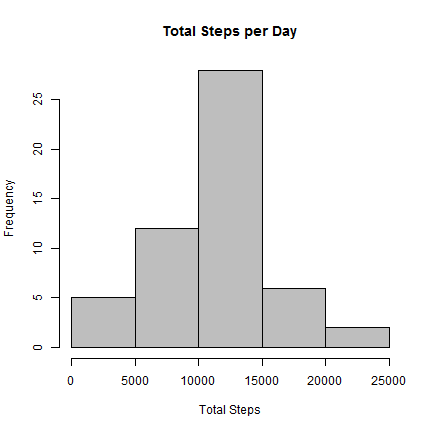
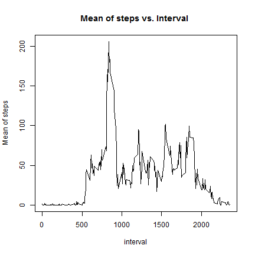
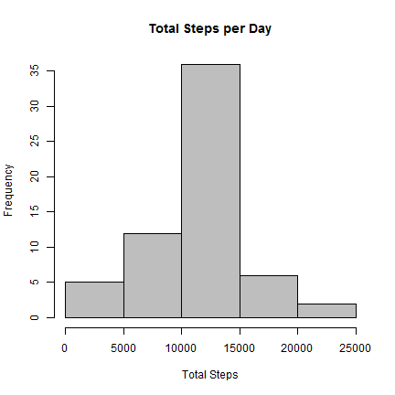
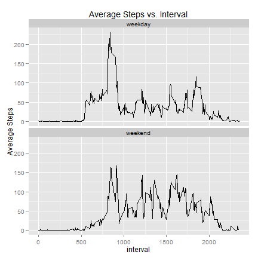

Reproducible Research: Peer Assessment 1
========================================================

R Properties
----------------------


```r
R.version
```

```
##                _                           
## platform       x86_64-w64-mingw32          
## arch           x86_64                      
## os             mingw32                     
## system         x86_64, mingw32             
## status                                     
## major          3                           
## minor          1.1                         
## year           2014                        
## month          07                          
## day            10                          
## svn rev        66115                       
## language       R                           
## version.string R version 3.1.1 (2014-07-10)
## nickname       Sock it to Me
```

```r
Sys.getlocale()  ## FROM BRAZIL ( Portuguese )
```

```
## [1] "LC_COLLATE=Portuguese_Brazil.1252;LC_CTYPE=Portuguese_Brazil.1252;LC_MONETARY=Portuguese_Brazil.1252;LC_NUMERIC=C;LC_TIME=Portuguese_Brazil.1252"
```


Loading necessary packages 
------------------------------------


```r
require(plyr)
require(ggplot2)
```


Loading and preprocessing the data
--------------------------------------

1.Load the data (i.e. read.csv())

```r
#read the datasource
source <- read.csv("activity.csv")

#View some values from "source"" dataframe 
head(source)
```

```
##   steps       date interval
## 1    NA 2012-10-01        0
## 2    NA 2012-10-01        5
## 3    NA 2012-10-01       10
## 4    NA 2012-10-01       15
## 5    NA 2012-10-01       20
## 6    NA 2012-10-01       25
```

```r
# View the summary from "source" dataframe
summary(source)
```

```
##      steps               date          interval   
##  Min.   :  0.0   2012-10-01:  288   Min.   :   0  
##  1st Qu.:  0.0   2012-10-02:  288   1st Qu.: 589  
##  Median :  0.0   2012-10-03:  288   Median :1178  
##  Mean   : 37.4   2012-10-04:  288   Mean   :1178  
##  3rd Qu.: 12.0   2012-10-05:  288   3rd Qu.:1766  
##  Max.   :806.0   2012-10-06:  288   Max.   :2355  
##  NA's   :2304    (Other)   :15840
```

```r
# View some some atribute from "source" dataframe
str(source)
```

```
## 'data.frame':	17568 obs. of  3 variables:
##  $ steps   : int  NA NA NA NA NA NA NA NA NA NA ...
##  $ date    : Factor w/ 61 levels "2012-10-01","2012-10-02",..: 1 1 1 1 1 1 1 1 1 1 ...
##  $ interval: int  0 5 10 15 20 25 30 35 40 45 ...
```


2.Process/transform the data (if necessary) into a format suitable for your analysis


```r
# Changing the data type of source$date to Date
source$date <- as.Date(source$date)
```


What is mean total number of steps taken per day?
--------------------------------------

1.Make a histogram of the total number of steps taken each day


```r
#Summarize the sum of steps grouped by date
steps_day <- ddply(source, .(date), summarize, total = sum(steps))

#Make the histogram 
hist(steps_day$total, main = "Total Steps per Day", xlab = "Total Steps", col = "gray")
```




2.Calculate and report the mean and median total number of steps taken per day


```r
mean(steps_day$total,na.rm=TRUE)
```

```
## [1] 10766
```

```r
median(steps_day$total,na.rm=TRUE)
```

```
## [1] 10765
```


* The mean of total steps taken per day is **1.0766 &times; 10<sup>4</sup>**.

* The median of total steps taken per day is  **10765**.


What is the average daily activity pattern?
--------------------------------------

1.Make a time series plot (i.e. type = "l") of the 5-minute interval (x-axis) 
and the average number of steps taken, averaged across all days (y-axis).


```r
#getting average daily activity grouping the mean of steps by interval
avg_steps_day <- ddply(source, .(interval), summarize, mean_steps = mean(steps,na.rm=T))

#plotting the average daily activity
plot(mean_steps ~ interval, data = avg_steps_day, type = "l",main = ("Mean of steps vs. Interval "), ylab = "Mean of steps")
```




2.Which 5-minute interval, on average across all the days in the dataset,contains the maximum number of steps?


```r
#find the maximum number of steps
avg_steps_day[which.max(avg_steps_day$mean_steps), ]$interval
```

```
## [1] 835
```


* It is the **835th** interval.

Imputing missing values
--------------------------------------

1.Calculate and report the total number of missing values in the dataset (i.e. the total number of rows with NAs)


```r
#Total missing values
sum(is.na(source$steps))
```

```
## [1] 2304
```


* There are **2304** values missing.


2.Devise a strategy for filling in all of the missing values in the dataset. 
The strategy does not need to be sophisticated. For example, you could use the mean/median for that day, or the mean for that 5-minute interval, etc.

 **I chose the strategy of setting  the mean for that 5-minute to all missing values.**

3.Create a new dataset that is equal to the original dataset but with the missing data filled in.


```r
# Getting the mean of steps for interval
avg_steps_day <- ddply(source, .(interval), summarize, mean_steps = mean(steps,na.rm=T))

#Merging the source dataframe with the avg_steps_day using the interval key
newdatasource <- merge(source, avg_steps_day, by=c("interval"))

#Filling all the missing values from newdatasource by the mean of steps on that interval.
count = 0  # Count the number of data filled in
for (i in 1:nrow(newdatasource)) {
  if (is.na(newdatasource[i, ]$steps)) {
    newdatasource[i, ]$steps <- newdatasource[i, ]$mean_steps
    count = count + 1
  }
}

## Shows the total values filled after the loop.
cat("Total ", count, "NA values were filled.\n\r")
```

```
## Total  2304 NA values were filled.
## 
```


4.Make a histogram of the total number of steps taken each day and Calculate and report
the mean and median total number of steps taken per day. 
Do these values differ from the estimates from the first part of the assignment?
What is the impact of imputing missing data on the estimates of the total daily number of steps?


```r
# Making a histogram of the total number of steps taken each day
steps_day_no_missing <- ddply(newdatasource, .(date), summarize, total = sum(steps))

hist(steps_day_no_missing$total, main = "Total Steps per Day", xlab = "Total Steps", col = "gray")
```




```r
#Calculate and report the mean and median total number of steps taken per day
mean(steps_day_no_missing$total)
```

```
## [1] 10766
```

```r
median(steps_day_no_missing$total)
```

```
## [1] 10766
```


* The mean of total steps taken per day is **1.0766 &times; 10<sup>4</sup>**.

* The median of total steps taken per day is  **1.0766 &times; 10<sup>4</sup>**.

*  The mean value is the same as the value before imputing missing data because we put the mean value for that particular 5-min interval. The median value shows a little difference .


Are there differences in activity patterns between weekdays and weekends?
--------------------------------------

1.Create a new factor variable in the dataset with two levels -- "weekday" and "weekend" indicating
whether a given date is a weekday or weekend day.


```r
# I'm using Brazilian Locale ( Portuguese ), so the weekend days are:
# saturday -> sábado 
# sunday  -> domingo 
newdatasource$day <- as.factor(ifelse(weekdays(newdatasource$date) %in% c("sábado","domingo"),"weekend","weekday"))
```


2.Make a panel plot containing a time series plot (i.e. type = "l") of the 5-minute 
interval (x-axis) and the average number of steps taken, averaged across all weekday days or weekend 
days (y-axis). 


```r
avg_steps_day <- ddply(newdatasource, .(day,interval), summarize, mean_steps = mean(steps,na.rm=T))

qplot(interval,mean_steps,data=avg_steps_day,ylab="Average Steps",main="Average Steps vs. Interval" ,group=day,geom = "line") + facet_wrap(~ day, ncol=1)
```




Removing all variables from R memory. 
-------------------------------------------


```r
# remove the variables to free memory
rm(list=ls())
```


